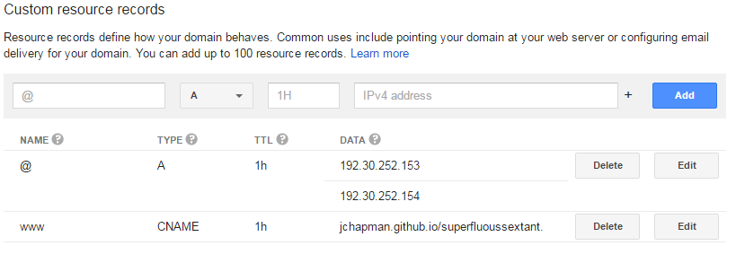
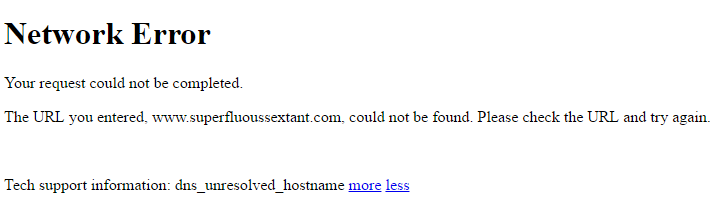
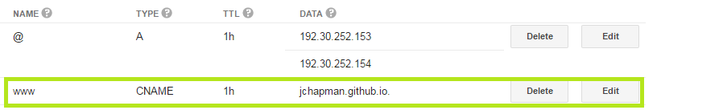

DNS error when going to www subdomain of github pages hosted website
####################################################################

:date: 2016-08-15
:tags: meta, blog, help, dns, google, domain
:category: meta
:slug: dns-error-fix

I was having an issue when trying to access my blog through the www subdomain, but I managed to fix it!
The issue was roughly as described in the title, I was able to access ``superfluoussextant.com``, but I was unable to access ``www.superfluoussextant.com``.
I decided to make a blog post every time I find an issue that I couldn't solve trivially through googling, here goes the first one.

My Stack
~~~~~~~~

Here is a list of relevant technologies I'm using to bring this blog to you:

    - `Google Domains <https://domains.google.com>`_ $12/year for a domain managed by google
    - `Github Pages <https://pages.github.com/>`_ Free hosting with some very `reasonable limits <https://help.github.com/articles/what-is-github-pages/#recommended-limits>`_

I have set up a github repo with a project page by creating a ``gh-pages`` branch, setting the custom domain, and creating a ``CNAME`` file with the following contents:

::

    superfluoussextant.com
    www.superfluoussextant.com

I had also set up the following custom resource records through google's DNS settings

My Issue
~~~~~~~~

Although I could reach my blog through the apex domain ``superfluoussextant.com``, I couldn't reach it through the www subdomain ``www.superfluoussextant.com``. 
The error I saw was ``dns_unresolved_hostname``, you can see how it expressed itself in the image below (actual manifestation depends on DNS).

I had been following the `excellent tutorial <http://www.curtismlarson.com/blog/2015/04/12/github-pages-google-domains/>`_ by Curtis Larson, but there was a difference between his tutorial and what I wanted to do: he was using a custom domain for a user github page while I was trying to use a custom domain with a project page.
(I thought) the only difference between the two was the default url where they are served by github pages.
By default user pages are served at ``user.github.io`` while project pages are served at ``user.github.io/projectName``.

The Fix
~~~~~~~

Because I was publishing a project page, I strayed from the tutorial by setting my CNAME record to ``jchapman.github.io/superfluoussextant``, however this was not correct.
Even though I was trying to publish a project page instead of a user page, I still needed to make the CNAME record point to ``jchapman.github.io``.
The correct records are below, the changed one is highlighted.

If you're having a similar issue, all you have to do is make sure that your CNAME record points to ``username.github.io`` even if you are trying to publish a project page with a custom domain.
Also remember that it takes some time for DNS record changes, for me it was at least an hour.

Please let me know if this helped you by commenting below!
